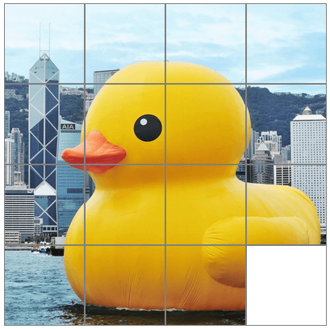

# Image Puzzle Game
This is a 4x4 puzzle game with the image of a Duck

## Instructions
1. The first time you see the image is how you should arrange the puzzle. [See the preview](#Preview)

2. Then you press the "Scramble" button to mix up the puzzle.

3. Every time you click on a non-blank tile, the tile you clicked and the blank tile will swap places.

4. Click until you solve the puzzle!

## Play!
[You can play here](https://alejvndrox.github.io/image-puzzle/)

## Preview

